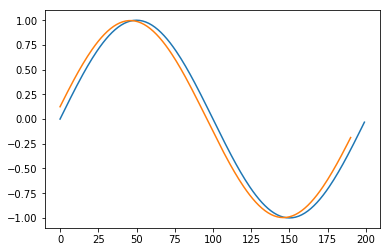

<h1> Moving Average Filter </h1>
<p>The moving average filter averages out the past $ n $ values and produces an output as that. It can be used to remove large discontinuities in the values. </p>


```python
# header initializations #
%matplotlib inline
import numpy as np
import matplotlib
import matplotlib.pyplot as plt
```


```python
def movavg(inp,n):
    N = inp.size
    op = np.zeros(inp.size-n+1)
    if N < n:
        return np.mean(inp)
    else:
        for i in range(op.size):
            op[i] = np.mean(inp[i:i+n-1:1])
        return op
```


```python
a = np.sin(np.array(range(200))*np.pi/100.0)
b = movavg(a,10)
plt.plot(a)
plt.plot(b)
```


    [<matplotlib.lines.Line2D at 0x7ff8dc260690>]




